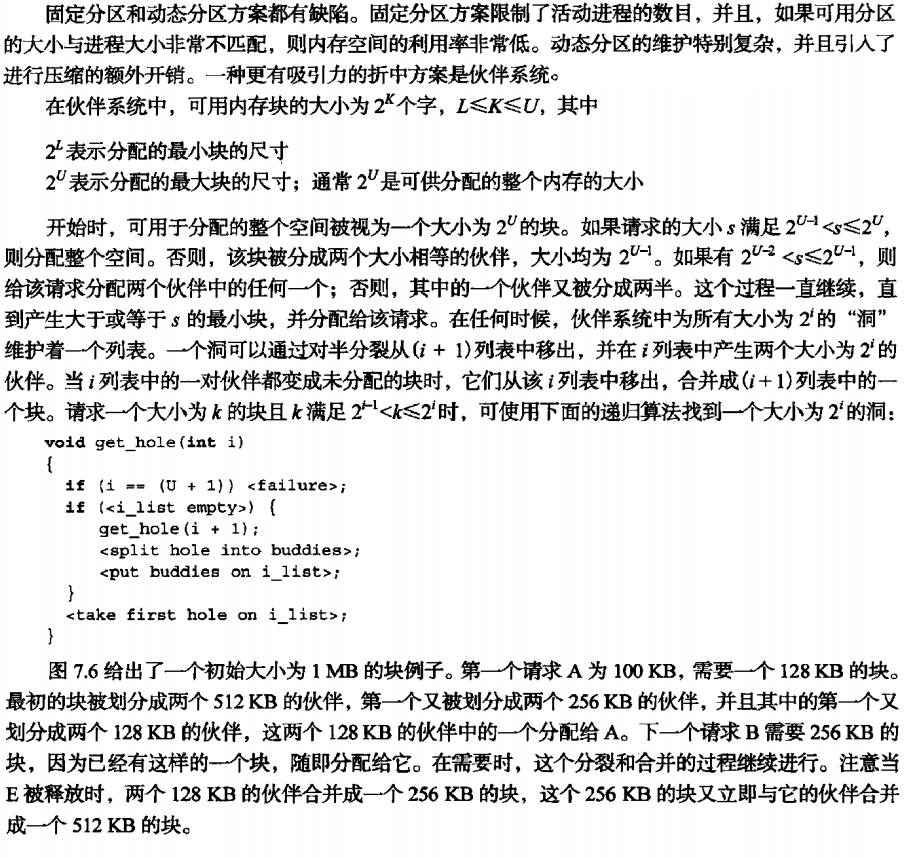
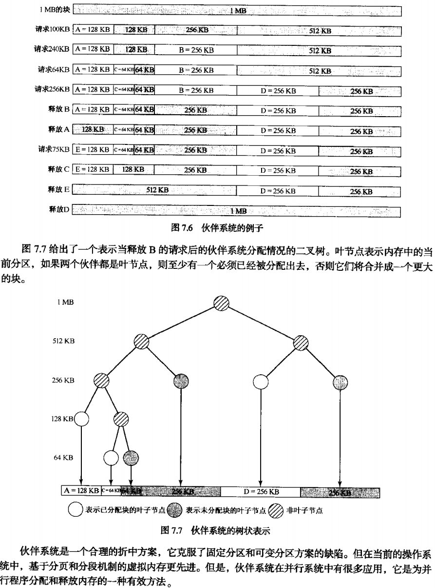

# Linux 伙伴算法简介

本文将简要介绍一下Linux内核中的伙伴分配算法。

## 算法作用
它要解决的问题是频繁地请求和释放不同大小的一组连续页框，必然导致在已分配页框的块内分散了许多小块的空闲页面，由此带来的问题是，即使有足够的空闲页框可以满足请求，但要分配一个大块的连续页框可能无法满足请求。

在 Linux 2.6 内核中,伙伴算法（Buddy system）把所有的空闲页框分为 **11** 个块链表，每块链表中分布包含特定的连续页框地址空间，比如第 **0** 个块链表包含大小为 **2<sup>0</sup>** 个连续的页框，第 **1** 个块链表中，每个链表元素包含 **2** 个页框大小的连续地址空间，….，第 **10** 个块链表中，每个链表元素代表 **4M** 的连续地址空间。每个链表中元素的个数在系统初始化时决定，在执行过程中，动态变化。

伙伴算法每次只能分配 **2** 的幂次页的空间，比如一次分配 **1** 页， **2** 页， **4** 页， **8** 页，…， **1024** 页( **2<sup>10</sup>** )等等，每页大小一般为 **4K** ，因此，伙伴算法最多一次能够分配 **4M** 的内存空间。

##核心概念和数据结构
 两个内存块，大小相同，地址连续(前一块的结尾和后一块的开始地址连续)，同属于一个大块(它们之前属于同一个大块,但是后来因为请求而分开了), 这两个内存块称之为伙伴( **buddy** ).

Linux 2.6为每个管理区使用不同的伙伴系统，内核空间分为三种区，DMA，NORMAL，HIGHMEM，对于每一种区，都有对应的伙伴算法.

### free_area数组
```cpp
struct free_area {
  struct list_head	free_list; // 空闲块双向链表
  unsigned long		nfree;	   // 空闲块的数目
}

struct zone_t {
  ...
  struct free_area 	free_area[MAX_ORDER]; // MAX_ORDER默认为11
  ...
}
```
上面的结构用图可以表示如下:


**free_area** 数组中，第 **k** 个元素，它标识所有大小为 **2<sup>k</sup>** 页的空闲块，所有空闲块由 **free_list** 指向的双向循环链表组织起来。其中的 **nr_free** 字段指定了对应空间剩余块的个数。

### 申请和回收过程

比如，我要分配 **4 * 2<sup>2</sup>** 页( **16k** )的内存空间，算法会先从 **free_area[2]** 中查看 **nr_free** 是否为空，如果有空闲块，则从中分配，如果没有空闲块，就从它的上一级 **free_area[3]** (每块 **32K** )中分配出 **16K** ，并将多余的内存( **16K** )加入到 **free_area[2]** 中去。如果 **free_area[3]** 也没有空闲，则从更上一级申请空间，依次递推，直到  **free_area[max_order]** ，如果顶级都没有空间，那么就报告分配失败。

释放是申请的逆过程，当释放一个内存块时，先在其对于的 **free_area** 链表中查找是否有伙伴存在，如果没有伙伴块，直接将释放的块插入链表头。如果有或板块的存在，则将其从链表摘下，合并成一个大块，然后继续查找合并后的块在更大一级链表中是否有伙伴的存在，直至不能合并或者已经合并至最大块 **2<sup>10</sup>** 为止。

内核试图将大小为 **b** 的一对空闲块(一个是现有空闲链表上的，一个是待回收的)，合并为一个大小为 **2b** 的单独块，如果它成功合并所释放的块，它会试图合并 **2b** 大小的块，如果可以合并的话,内核会继续试图合并  **2<sup>2</sup>b** 大小的块,这样一直递归下去,一直到不能合并为止.

### 伙伴算法的优缺点

优点：

+ 较好的解决外部碎片问题

+ 当需要分配若干个内存页面时，用于DMA的内存页面必须连续，伙伴算法很好的满足了这个要求

+ 只要请求的块不超过512个页面(2K)，内核就尽量分配连续的页面。

+ 针对大内存分配设计。


缺点：

+ 合并的要求太过严格，只能是满足伙伴关系的块才能合并，比如第1块和第2块就不能合并。

+ 碎片问题：一个连续的内存中仅仅一个页面被占用，导致整块内存区都不具备合并的条件

+ 浪费问题：伙伴算法只能分配 **2** 的幂次方内存区，当需要 **8K** ( **2** 页)时，好说，当需要 **9K** 时，那就需要分配 **16K** (**4**页)的内存空间，但是实际只用到 **9K** 空间，多余的 **7K** 空间就被浪费掉。

+ 算法的效率问题： 伙伴算法涉及了比较多的计算还有链表和位图的操作，开销还是比较大的，如果每次 **2<sup>n</sup>** 大小的伙伴块就会合并到 **2<sup>n+1</sup>**的链表队列中，那么 **2<sup>n</sup>** 大小链表中的块就会因为合并操作而减少，但系统随后立即有可能又有对该大小块的需求，为此必须再从 **2<sup>n+1</sup>** 大小的链表中拆分，这样的合并又立即拆分的过程是无效率的。


​    Linux针对大内存的物理地址分配，采用伙伴算法，如果是针对小于一个page的内存，频繁的分配和释放，有更加适宜的解决方案，如slab和kmem_cache等，这不在本文的讨论范围内。


## 关于伙伴系统更加系统的描述

下面的内容来自操作系统,精髓与设计原理.



