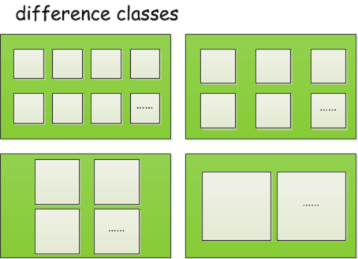

# slab介绍

内存分配与释放向来是程序设计中的难点，在C语言中有 **malloc** 可以方便使用，但还是有更多的针对具体业务的实现。内存分配需要考虑分配效率和内存使用率的平衡，当用户申请一块内存，程序需要在空闲内存中查找合适的内存块返回，这里可以选择一个最快获取的算法（ **first-fit** ），或者最优选择（ **best-fit** ）。二者往往无法两全。另外需要考虑一个根本性的问题就是内存碎片，释放内存时往往与申请顺序不同，会在内存中留下大量的空洞，当有大量不连续的小内存即碎片出现时，便会产生空闲内存很多但是无法分配大块内存的情况。对于操作系统，需要长时间运行，内存碎片的问题便显得非常突出了。

**Linux** 内核一种分配内存的方式是 **alloc_pages** ，使用伙伴算法，但这个只适应于按页分配，如果需要几个字节的内存都分配 **4k** ，显然会是极大的浪费，所以内核又提供了一种小内存的分配方式，称之为 **slab** ，另外还有两种可选的分配方式，**slob** 和 **slub** ， **slob** 是为了在嵌入式环境中使用，**slub** 在一些大型设备中比 **slab** 有更优秀的性能。但作为程序开发者来说，无需关心内核选用了哪种分配方式，三者具有相同的接口，调用者可以忽略其中的差别。

因为在内核中需要频繁分配同类型的对象，比如频繁分配 **socket** ， **task_struct** 等结构体对象， **slab** 一个核心思想就是一个 **slab** 分配器只分配一种对象，这样做的好处便是每个 **slab** 只分配等大小的内存，能够很好的兼顾效率和内存碎片的问题，当然 **slab** 最终也是通过 **alloc_pages** 按页分配的内存。

## slab的实现简介

**slab** 内存分配是一种用来高效管理内存的机制，可以避免频繁申请和释放内存带来的内存碎片问题， 同时提高内存分配效率。最早是在 Solaris 2.4的内核引入这个算法， 后面广泛应用在许多Unix和 类Unix(如FreeBSD)的操作系统上， 而在linux上直到2.6.23才成为默认的分配方式。 **slab** 分配最简单的理解,  **就是每次使用内存时，一次申请一片大内存，当需要使用内存时， 直接从slab分配，释放也是放回slab, 而不必从操作系统不断分配和释放** 。

为了可以重复分配和释放 **slab** 里面的 **item** , 我们正常时把一个 **slab** 切分成长度相等的 **item** , 比如有 **1M** 大小的 **slab** ，每个 **item** 是 **1024byte** , 那么该 **slab** 就被切分成 **1M/1024 = 1024** 个 **item** .

简单版的 **slab** 如下图所示:


由于并不是每次申请的长度都是一样的，这就需要不同 **item** 长度的 **slab** , 我们可以设定 **slabclass** 这样一种结构,它是不同长度 **item** 的 **slab** 的集合。在设计 **slabclass** 的时候，可以把 **slabclass** 看作一个 **item** 长度递增 的数组，并把 **slab** 放到对应的队列中。当试图分配空间的时候，只要找到能容纳请求长度的 **slabclass** ,然后从未使用完或者空闲的 **slab** , 分配一个 **item** 空间。

下图是不同大小的 **slabclass** 构成的一个印象图. **slabclass** 对应图中绿色的大方块,  **slab** 对应图中灰色的小方块. 其中同一个 **slabclass** 中每一个 **slab** 对应 **item** 的长度都是一致的.



作为参考,我们可以采用这样的方式来决定每种 **slabclass** 的 **item** 的长度.

假定我们要产生 **n** 个 **slabclass** , 每个 **slab** 是 **1M** , 第一级 **item** 长度是 **100byte** , 每级增长因子是 **1.2** 。

第一级 **item** 的长是 **100bytes** , **item count = 1M/100**

第二级 **item** 的长度是 **100byte * 1.2 = 120byte** ,  **item count = 1M/120**

第三级 **item**的长度是 **120*1.2 = 144bytes** , **item count = 1M/144**

依次类推.

当需要申请 **80byte** 的内存时候， 从第一级开始找，直到遇到第一个比它大的 **slab** , 这里就是第一级的 **slab** 。 如果要申请 **130bytes**的内存， 就是找到第三级.

看过上面的内容之后，应该能知道 **slab** 大概的样子，以及 **slabclass**是干嘛的。 **slabcloass** 每一级 **slab** 可以分配 的 **item** 长度和数量是固定的， 所以 **slab** 可能会有三种状态:  **free slab** (完全没有使用)，  **partial slab** (部分使用),  **full slab** (全部使用).

最开始， 由于没开始使用，只会有 **free slab** ， 当使用一段时间后，就转换为 **partial slab** , 如果这个 **slab** 已经被分配完， 则会变为 **full slab** .

我们可以将这3类**slab** 根据他们的状态,拉成三个队列,这样的话,实际分配空间的时候,搜寻起来也会方便很多.

当某一级需要分配空间， 会经历下面的步骤：

```shell
1. 如果这一级partial slab队列不为空， 先从这个队列里面取, 如果不为空，直接分配， 判断slab是满了，是？移到full slab队列。
2. 如果这一级parital slab队列为空， 从free slab队列获取一个slab, 放到这一级slab，重新分配。
```
当然,这只是一个简要的描述,