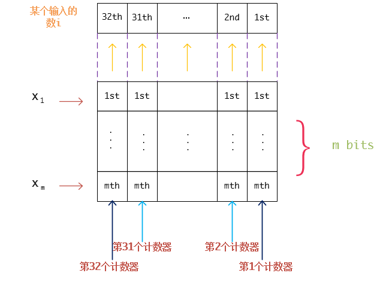

给一个整数数组,其中的每个数都出现了 k 次( k >1),除了一个数,它出现了 p  次,( p >= 1, p % k != 0),请找出这个数.

为了使用位操作解决这个问题,我们应当思考一下计算机是如何表示一个整数的.很明显,答案是二进制比特.首先,让我们考虑仅有一个bit的情况,假定我们有一个由仅有一个bit的数构成的数组(这些数只可能是0或者1),我们要在这个数组中数 1 的个数,只要碰到的 1 的个数达到了特定的数目,比如说k ,计数值重新设为0,然后重新开始计数 .为了记录我们遇到过的1的数目,我们需要一个计数器counter.假定计数器有m个bit,它在电脑中可以这样来表示x<sub>m</sub>,  ..., x<sub>1</sub> 我们可以总结出关于计数器counter的一些性质.

1. counter有一个初始值,也就是 0;
2. 对于数组中的每个数,如果我们碰到了一个 0,那么counter不会改变.
3. 我们如果在数组中碰到了一个1 ,那么计数器counter应该加1
4. 为了使得计数器能够记到 k次,那么2<sub>m</sub> >= k,这也就意味着 m >= log<sub>k</sub>.


接下来就是最核心的问题了,随着我们遍历数组, counter里面的每个bit( x<sub>1</sub> 到 x<sub>m</sub> )会发生什么样的改变? 我们先回答一个简单一点的问题,如果仅仅为了满足上面的第二条性质,什么位操作可以满足需求呢?这种位操作为 `|`或者 `^` (异或), 因为`x = x | 0` 以及 `x = x ^ 0` .

我们已经有了些许头绪: `x = x | i` 或者 `x = x ^ i`, `i` 为数组中的元素. 那么究竟哪一个位操作更加合适呢?我们现在还不知道.但是我们可以用一些实际的例子来测试一下.

在最开始遍历之前, counter中的每一个bit都为 `0` ,即 x<sub>m</sub> = 0, ..., x<sub>1</sub> = 0. 由于我们要选择某种位操作,以保证遇到 `0` 的时候,counter中的每一个bit都不会改变, 直到我们遇到第一个 `1` 之前, counter一直为 `0`, 我们遍历到第一个 `1`之后,有 **x<sub>m</sub> = 0, ...,x<sub>2</sub> = 0, x<sub>1</sub> = 1** ,我们继续, 遇到第 `2`个 `1` 之后,有 **x<sub>m </sub>= 0, ..., x<sub>2</sub> = 1, x<sub>1</sub> = 0**. 值得注意的是, **x<sub>1</sub>** 从 `1` 变为了 `0` ,如果采用操作 **x<sub>1</sub> = x<sub>1</sub> | i** 的话,在遇到第 `2` 个 `1` 之后, **x<sub>1</sub>** 将仍为`1` ,很明显,操作**x<sub>1</sub> = x<sub>1</sub>^ i ** 更为合适.那么 **x<sub>2</sub>, ..., x<sub>m</sub>** 呢?

接下来的疑问是,在什么条件下,使得 **x<sub>2</sub>, ..., x<sub>m</sub>** 将会改变他们的值,我们拿 **x<sub>2</sub>** 做一个例子.如果我们遍历到了一个`1` 之后, **x<sub>2</sub>** 的值也发生了改变,在改变之前, **x<sub>1</sub>** 的值应当是什么呢?答案是 `1` ,否则的话, **x<sub>2</sub>** 的值是不可能改变的,因为将 **x<sub>1</sub>** 从 `0` 变为 `1`是个更为恰当的选择.

因此 **x<sub>2</sub>** 将会改变当且仅当 **x<sub>1</sub>** 和 `i` 都为 `1` ,用更为抽象的形式可以表达为 **x<sub>2</sub> = x<sub>2</sub> ^ (x<sub>1</sub> & i)**. 推广这个结论的话,我们可以得到 **x<sub>m</sub>**的值改变的条件为,仅当 **x<sub>m-1</sub>, ..., x<sub>1</sub>** 以及 `i`全部为 `1` : **x<sub>m</sub> = x<sub>m</sub> ^ (x<sub>m-1</sub> & ... & x<sub>1</sub> & i)**. 到了这里,我们基本上就已经可以确定对应的位操作了.

也许,你已经注意到了,如果 **k < 2<sub>m</sub> - 1** 的话,上面提及的位操作会从 `0` 计数到 **2<sub>m</sub> - 1**, 而不是 `k` ,,我们需要某种切分(cutting)机制,使得当counter计数达到了 `k` 的时候,重新将counter变为 `0`, , 因为这个缘故,我们可以采用 `&` 操作,将 **x<sub>m</sub>, ..., x<sub>1</sub>** 和掩码 `mask`进行 `&` 操作. 即 **x<sub>m</sub> = x<sub>m</sub> & mask, ..., x<sub>1</sub> = x<sub>1</sub> & mask**. 如果我们可以保证当counter达到 `k` 的时候, `mask` 为0,而其余时候,掩码都为 `1`的话,那么一切都完成了.关键的问题在于,我们应当如何达成这个目标?

计数值 `k` 和其余的计数值有什么不一样呢? 对,它是 `1` 的计数.

对于每一个计数值,counter都有一个独特的bit值的组合与之对应,我们可以将其视为状态.如果我们写出 `k` 的二进制形式`km, ..., k1` ( `k` 为其余的数出现的次数).那么我们可以通过下面的方法来构建掩码 `mask`:

`mask = ~(y1 & y2 & .. & ym)`, 其中如果`kj = 1`的话, `yj = xj` ,如果 `kj = 0` 的话, `yj = ~xj` (`j`从`1` 到 `m` )

接下来举一些例子:

`k = 3: k1 = 1, k2 = 1, mask = ~(x1 & x2)`,  当计数值达到 `3` 时, `x1 = 1, x2 = 1, mask = ~(1 & 1) = 0, x1 = x1 & mask = 0, x2 = x2 & mask = 0`, 计数值为 `1` 时, `x1 = 1, x2 = 0, mask = ~(1 & 0) = 1, x1 = 1, x2 = 0` .

`k = 5: k1 = 1, k2 = 0, k3 = 1, mask = ~(x1 & ~x2 & x3)` ,和上面类似,计数值达到 `5` 时, `mask = 1` , 其余时候, `mask = 0`.

总之,我们的算法长这个样子:

```cpp
for (int i : array) {
    xm ^= (xm-1 & ... & x1 & i);
    xm-1 ^= (xm-2 & ... & x1 & i);
    .....
    x1 ^= i;
    
    mask = ~(y1 & y2 & ... & ym)  where yj = xj  if kj = 1 and  yj = ~xj  if kj = 0 (j = 1 to m).

    xm &= mask;
    ......
    x1 &= mask;
}
```

现在,是时候将我们的结果从1-bit的数的例子扩展到32-bit的整数了,一个直接了当的方式是构建32个counter,整数中的每个bit都对应一个counter.但是,如果你对位操作更为熟悉一点的话,我们其实可以同时操作这 `32` 个counter的,这意味着,我们可以仅用 `m` 个32-bit的整数而不是用32个m-bit的counter 来完成我们的操作, 其中`m` 是满足`m >= logk` 的最小整数.

可以同时操控这 `32` 个bit的原因在于,一个 `32` 位的整数可以被看做是32个独立的位,每一个位都可以单独考虑.又由于所有的位的操作都是相同的,所以我们可以将 `32` 个计数器组合在一起,

因为每个counter有`m` 个比特,我们最终获得了 `m`个32-bit的整数.因此,在上面的算法中,我们仅需要将 `x1`到 `xm` 视作一个32-bit的整数而不是一个1-bit的数,很容易,不是吗?



为了下文叙述的方便,我们将问题中要找的值记为 `s` .

最后一个疑问是我们应该返回什么值,或者说, `x<sub>1</sub>` 到 `x<sub>m</sub>` 中的哪一个等于最终的结果.

在回答这个问题之前,我们首先要弄清楚, `m` 个32-bit的整数 `x<sub>1</sub>` 到 `x<sub>m</sub>` 代表着什么.我们用 `x<sub>1</sub>` 作为一个例子. `x<sub>1</sub>` 有`32` 个比特,让我们将这些比特位标记为 `r`( `r = 1` to `32` ).当我们遍历完整个输入数组之后, `x1` 的第 `r` 个bit将会由数组中所有数的第 `r` 个 bit来决定,更确切地说,由数组中的所有数的第 `r` 个bit中 `1` 的数目所决定,假定在第 `r` 个bit位上 `1` 一共出现了`q` 次,`q' = q % k` ,它的二进制表示形式为 `q'm, ..., q'1`  ,根据定义, `x<sub>1</sub>` 的第 `r` 个bit将会等于`q'1`.

 `x<sub>1</sub>` 的第 `r` 个bit为 `1` ,这意味着什么?究竟是什么原因使得该bit为 `1` 呢?一个元素在数组中出现了 `k` 次能够使得 `x1` 的第 `r` 个bit为 `1` 吗?答案是否定的,为什么呢?因为一个元素如果能够使得第 `r` 个bit为 `1`的话,它必须同时满足两个条件,第一是这个元素的第 `r` 个bit为 `1` ,并且,该元素的出现次数不为 `k` 的倍数.

第一个条件显而易见,第二个条件来自这样一个事实.当 `1` 的数目达到 `k` 之后,计数器将会回卷到 `0` ,这意味着,如果一个元素出现了 `k` 次, `x<sub>1</sub>`中对应的bit位将会被设定为 `0`,它是不可能同时满足这两个条件的.

因此到最后,只有那个出现了 `p` 次的元素会在计数器中留下踪迹. 如果 `p` 为 `k`的倍数,即 `p % k == 0`, 那么遍历完数组之后,该元素会和其他元素一样,消失得了无踪迹,因为计数器一旦到达 `k`,就会立马归零,这也是我们前面为什么要设定 `p % k != 0`这个条件的原因.我们将 `p' = p % k` 记为该元素出现的有效次数.

将 `p'` 写成二进制形式: `p'<sub>m</sub>, ..., p'<sub>1</sub>` , **如果 `x<sub>1</sub> == s` 话,那么一定有`p'<sub>1</sub> = 1`**, 下面是一个简要的证明.

如果 `x<sub>1</sub>` 的第 `r` 个bit为 `1` , 那么 `s` 的第 `r`个bit也必定为 `1` , 这一点显而易见. 我们接下来要证明的是,如果 `x<sub>1</sub>`的第 `r` 个bit为 `0` ,那么`s` 第 `r` 个bit也为 `0`.

假定 `s` 第 `r` 个bit为 `1` ,并且遍历数组之后, `x<sub>1</sub>`的第 `r` 个bit为 `0`, 实际上,遍历完数组,这个`s`的第 `r` 个bit上的 `1` 将会被计数`p'` 次,我们将 `p'`  写成二进制形式 `p'<sub>m</sub>, ..., p'<sub>1</sub>`, 根据定义, `x<sub>1</sub>` 的第 `r` 个bit会等于 `p'1`, 而 `p'1 = 1`, 这个和我们之前的假设( `x1` 的第 `r` 个bit为`0` )矛盾.


因为这个对 `x1` 的所有bit都成立,因此我们可以得到结论:如果`p'<sub>1</sub> = 1`的话,  `x1` 将会是我们要求的数.相似的,我们可以证明如果`p'<sub>j</sub> = 1`的话, `x<sub>j</sub>` 将会是最终的结果( `j = 1` to `m` ).

现在一切问题都解决了,首先计算`p' = p % k`, 并将 `p'` 表示成它的二进制形式,如果`p'<sub>j</sub> = 1`, 则 `x<sub>j</sub>`就是最终的结果( `j = 1` 到 `m`), 也就是说,答案可以有多个.

最后总结一下,整个算法的时间复杂度为 `O(n * logk)`, 空间复杂度为 `o(logk)`.


下面是一些例子:

1. `k = 2, p = 1`

   其余数字都出现 `2` 次,另外一个数字出现 `1` 次,这样的话,我们需要一个32-bit的整数作为计数器, 

   `k`为2, m为1, 我们仅需要一个32-bit的整数(x1) 作为计数器.由 `2^m = k`,因此我们甚至不需要掩码值了,下面是完整的java代码:

   ```cpp
    public int singleNumber(int[] A) {
            int x1 = 0;      
            for (int i : A) {
               x1 ^= i;
            }
            return x1;
       }
   ```

   2. `k = 3, p = 1`

      一个数字出现 `1` 次,其余数字出现 `3` 次,我们需要两个32-bit的整数( `x2` , `x1` )做计数器. 由于`2^m > k`, 因此我们需要一个掩码,将 `k` 的二进制形式表示出来: k = `11` , 有 `k1 = 1, k2 = 1`,因此,我们有掩码 `mask = ~(x1 & x2)`.完整的java代码如下:

      ```cpp
       public int singleNumber(int[] A) {
               int x1 = 0;   
               int x2 = 0; 
               int mask = 0;
         
               for (int i : A) {
                  x2 ^= x1 & i; // x2 = x2 ^ (x1 & i)
                  x1 ^= i; // x1 = x1 ^ i
                  mask = ~(x1 & x2); 
                  x2 &= mask;
                  x1 &= mask;
               }

               return x1;  
         // p = 1, in binary form p = '01', then p1 = 1, so we should return x1; 
         // if p = 2, in binary form p = '10', then p2 = 1, so we should return x2.
       }
      ```

      ​

2. `k = 5, p = 3`

   k为5,那么m=3, 我们需要3个32-bit的整数(x3, x2, x1)作为计数器. 由于`2^m > k` 因此,我们需要一个掩码.将k写成二进制的形式: `k = 101`, 因此k1 = 1, k2 = 0, k3 = 1,所以 `mask = ~(x1 & ~x2 & x3)` , java代码如下:

   ```java
    public int singleNumber(int[] A) {
            int x1 = 0;   
            int x2 = 0; 
            int x3  = 0;
            int mask = 0;
      
            for (int i : A) {
               x3 ^= x2 & x1 & i;
               x2 ^= x1 & i;
               x1 ^= i;
               mask = ~(x1 & ~x2 & x3);
               x3 &= mask;
               x2 &= mask;
               x1 &= mask;
            }

            return x1;  // p = 3, in binary form p = '011', then p1 = p2 = 1, 
                        // so we can return either x1 or x2; 
                        // But if p = 4, in binary form p = '100', then only p3 = 1, 
                        // which implies we can only return x3.
   }
   ```

   你可以很快想到其他的例子.