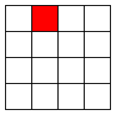
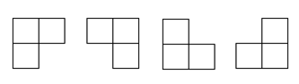
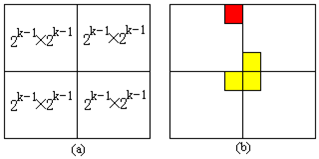
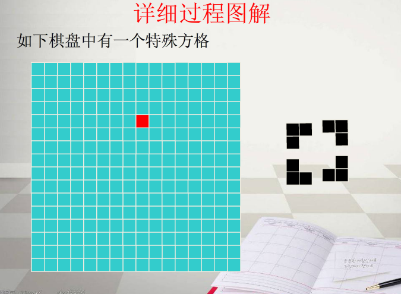
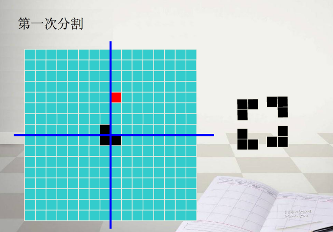
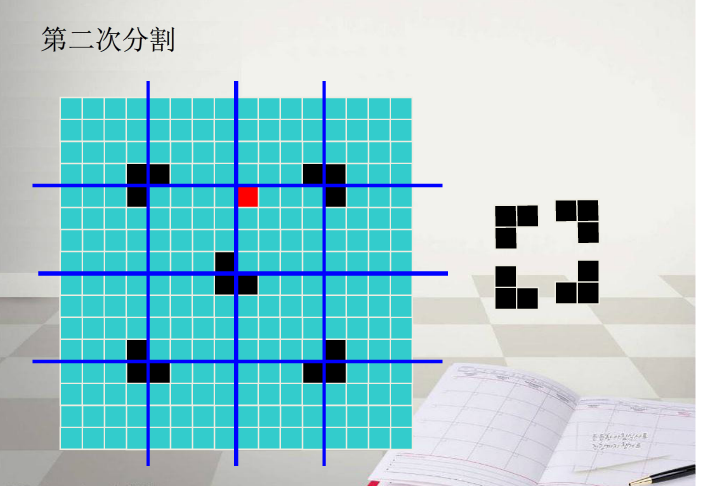
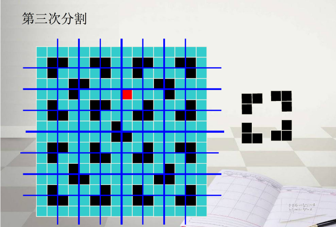
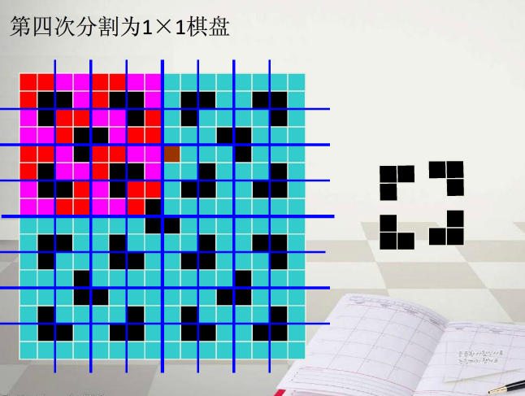

# 棋盘覆盖问题

## 问题描述

在一个2<sup>k</sup>×2<sup>k</sup> 个方格组成的棋盘中，恰有一个方格与其他方格不同，称该方格为一特殊方格，且称该棋盘为一特殊棋盘。在棋盘覆盖问题中，要用图示的4种不同形态的L型骨牌覆盖给定的特殊棋盘上除特殊方格以外的所有方格，且任何2个L型骨牌不得重叠覆盖。





## 解题思路

**分析**：当k>0时，可将2<sup>k</sup>×2<sup>k</sup>大小的棋盘分割为4个2<sup>k-1</sup>×2<sup>k-1</sup> 大小的子棋盘,如下图(a)所示。特殊方格必位于4个较小子棋盘之一中，其余3个子棋盘中无特殊方格。为了将这3个无特殊方格的子棋盘转化为特殊棋盘，可以用一个L型骨牌覆盖这3个较小棋盘的会合处，如 (b)所示，从而将原问题转化为4个较小规模的棋盘覆盖问题。递归地使用这种分割，直至棋盘简化为棋盘1×1.

如果棋盘大小只有1×1,那么,棋盘中仅有的一个位置放的必定是特殊块,那么自然无需再处理.



一个简单的实例:








```cpp
#include <iostream>
#include <vector>
using namespace std;


/**
 * @brief 输出棋盘
 * @param[in] chessboard 棋盘数据
 * @return 无
 */
void 
print_chessboard(vector<vector<char>>& chessboard) {
	int n_rows = chessboard.size();
	int n_columns = chessboard[0].size();
	for (int i = 0; i < n_rows; i++) {
		for (int j = 0; j < n_columns; j++) {
			cout << chessboard[i][j];
		}
		cout << endl;
	}
}

class ChessboardCovering {
private:
	char mark_;
	struct Coord {
		int row;
		int column;
		Coord(int x, int y) : row(x), column(y) {}
	};
public:
	ChessboardCovering() : mark_('c') {}
private:
	/**
	 * @brief 棋盘覆盖问题的求解.
	 * @param[inout] chessboard 棋盘数据,二维数组
	 * @param[in] topleft 棋盘左上角的位置,这个位置起到了确定整个棋盘的作用
	 * @param[in] special 棋盘上特殊块的位置
	 * @param[in] size 棋盘的长和宽的大小
	 * @return 无
	 */
	void
	covering_solver(vector<vector<char>>& chessboard, Coord topleft, Coord special, int board_size)
	{
		if (board_size == 1) return; /* 递归终止条件 */
		int subboard_size = board_size / 2; /* 子棋盘的大小 */
		char mark = mark_++;

		{ /* 特殊块位于左上的子棋盘内 */
			if (special.row < topleft.row + subboard_size &&
				special.column < topleft.column + subboard_size) {
				covering_solver(chessboard, topleft, special, subboard_size);
			}
			else { /* 特殊块不位于左上子棋盘内,覆盖左上子棋盘的右下角 */
				Coord fake_special(topleft.row + subboard_size - 1, topleft.column + subboard_size - 1);
				chessboard[fake_special.row][fake_special.column] = mark;
				covering_solver(chessboard, topleft, fake_special, subboard_size);
			}
		}

		{ /* 特殊块位于右上的棋盘之内 */
			Coord fake_topleft(topleft.row, topleft.column + subboard_size);
			if (special.row < topleft.row + subboard_size &&
				special.column >= topleft.column + subboard_size) {
				covering_solver(chessboard, fake_topleft, special, subboard_size);
			}
			else {
				/* 特殊并不在右上的棋盘之内,需要构建假的特殊块 */
				Coord fake_special(topleft.row + subboard_size - 1, topleft.column + subboard_size);
				chessboard[fake_special.row][fake_special.column] = mark;
				covering_solver(chessboard, fake_topleft, fake_special, subboard_size);
			}
		}

		{ /* 左下角 */
			Coord fake_topleft(topleft.row + subboard_size, topleft.column);
			if (special.row >= topleft.row + subboard_size &&
				special.column <= topleft.column + subboard_size - 1) {
				covering_solver(chessboard, fake_topleft, special, subboard_size);
			}
			else {
				Coord fake_special(topleft.row + subboard_size, topleft.column + subboard_size - 1);
				chessboard[fake_special.row][fake_special.column] = mark;
				covering_solver(chessboard, fake_topleft, fake_special, subboard_size);
			}
		}

		{ /* 右下角 */
			Coord fake_topleft(topleft.row + subboard_size, topleft.column + subboard_size);
			if (special.row > topleft.row + subboard_size - 1 &&
				special.column > topleft.column + subboard_size - 1) {
				covering_solver(chessboard, fake_topleft, special, subboard_size);
			}
			else {
				Coord fake_special(topleft.row + subboard_size, topleft.column + subboard_size);
				chessboard[fake_special.row][fake_special.column] = mark;
				covering_solver(chessboard, fake_topleft, fake_special, subboard_size);
			}
		}
	}
public:
	/**
	 * @brief 解决棋盘覆盖问题
	 * @param[inout] chessboard 棋盘数据
	 * @param[in] special_row, special_cloumn 特殊块所在的行和列,有且仅有一个特殊块
	 * @return 无
	 */
	void
	solve(vector<vector<char>>& chessboard, int special_row, int special_cloumn)
	{
		covering_solver(chessboard, Coord(0, 0), Coord(special_row, special_cloumn), chessboard.size());
	}
};

int main()
{
	vector<char> r1 = { 'a', 'a', 'a', 'b', 'a', 'a', 'a', 'a' };
	vector<char> r2 = { 'a', 'a', 'a', 'a', 'a', 'a', 'a', 'a' };
	vector<char> r3 = { 'a', 'a', 'a', 'a', 'a', 'a', 'a', 'a' };
	vector<char> r4 = { 'a', 'a', 'a', 'a', 'a', 'a', 'a', 'a' };
	vector<char> r5 = { 'a', 'a', 'a', 'a', 'a', 'a', 'a', 'a' };
	vector<char> r6 = { 'a', 'a', 'a', 'a', 'a', 'a', 'a', 'a' };
	vector<char> r7 = { 'a', 'a', 'a', 'a', 'a', 'a', 'a', 'a' };
	vector<char> r8 = { 'a', 'a', 'a', 'a', 'a', 'a', 'a', 'a' };
	vector<vector<char>> chessboard;
	chessboard.push_back(r1);
	chessboard.push_back(r2);
	chessboard.push_back(r3);
	chessboard.push_back(r4);
	chessboard.push_back(r5);
	chessboard.push_back(r6);
	chessboard.push_back(r7);
	chessboard.push_back(r8);
	ChessboardCovering cc;
	cc.solve(chessboard, 0, 3);
	print_chessboard(chessboard);
	getchar();
}
```

## 图片来源

[http://blog.csdn.net/acm_jl/article/details/50938164](http://blog.csdn.net/acm_jl/article/details/50938164)

