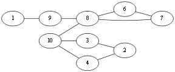
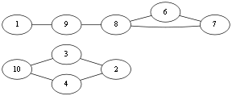
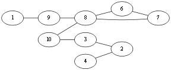
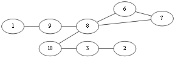
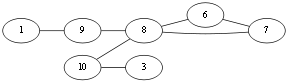
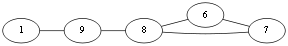
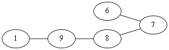
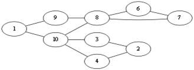

# 欧拉图 欧拉回路 欧拉通路

文章大部分来自[http://www.cnblogs.com/Ash-ly/p/5397702.html](http://www.cnblogs.com/Ash-ly/p/5397702.html)

## 定义

**欧拉回路**：对于图 **G** 的一条回路，如果该回路恰好通过图 **G** 的每一条边，则该回路称为欧拉回路，具有欧拉回路的图称为欧拉图。简而言之, 欧拉回路指的是从图上的一点出发，经过所有边且只能经过一次，并最终回到起点的路径。

**欧拉通路**：在欧拉回路定义的基础上做一些弱化, 从起点出发的路径可以不用回到起点，但是必须经过每一条边，且只能一次,这样的路径称作欧拉通路。如果我们把我们经常玩的"一笔画"游戏抽象一下,你会发现,它只是欧拉通路的一个简单应用而已。

## 性质

**欧拉回路** ：一个欧拉回路，删掉一个点，仍然是一个欧拉回路。从一个欧拉回路拖走一个小欧拉回路，结果也是一个欧拉回路。

## 判定（充要）：

欧拉回路：
1. 图 **G** 必须是连通的，不能有孤立点存在。
2. **对于无向图来说度数为奇数的点个数为0; 对于有向图来说每个点的入度必须等于出度。**

欧拉通路：
1. 图 **G** 必须是连通的，无孤立点存在。

2. 对于无向图来说，度数为奇数的的点可以有2个或者0个，并且这两个奇点其中一个为起点另外一个为终点。对于有向图来说，可以存在两个点，其入度不等于出度，其中一个入度比出度大1，为路径的起点；另外一个出度比入度大1，为路径的终点。

## 算法（求欧拉回路）

### **Fleury** 算法:

设图 **G** 是一个无向欧拉图，则按照下面算法求欧拉回路:

1. 任取 **G** 中一个顶点 **v0**,令 **P0 = v0** . (P表示PATH).

2. 假定我们沿这路径 **Pi = v0 e1 v1 e2 v2…… ei vi** 走到了顶点 **vi** .

   接下来需要从余下的边构成的集合 **E(G) -  {e1, e2, e3, … ,ei}** 中选择一条边作为 **ei+1**, 被选择的边必须满足下面的两个条件:

+ **ei+1**从顶点**vi** 出发,当然,无向图没有方向的概念,我们可以换个说法, **ei+1** 有一端连在顶点 **vi** 上.

+ 在顶点 **vi** 处除非没有别的边可供选择，否则我们的 **ei+1** 不应是子图 **Gi = G – {v0, e1, v1, e2, v2, …… , ei, vi}** 中的桥边. 假若只剩下桥边可选,除删除这条边之外,还应该再把孤立点从 **Gi** 中移除(选择桥边必然会形成孤立的点).

选择完成后移除 **ei+1** 这条边.

3. 当步骤 2 无法继续执行时停止算法.

当算法停止时，所得到的简单回路 **Pm = v0 e1 v1 e2 v2 e3 v3 …… em vm  (vm = v0)** 为图 **G**的一条欧拉回路.

### 例子

随便选定一个起点 **v1**。当前处在 **v1** 点，有两种走法 **v1 => v9**, **v1 => v10**，这两条边都不是桥边，那么随便选择一个，就 **<v1, v10>** 这条边了。那么图就会成为这样. 我们用 **Eu** 来记录已经遍历过的边,那么此刻,**Eu = {<v1, v10>}** .

当前行进到 **v10** ，可供选择的边有 **<v10 , v4>**, **<v10, v3>**, **<v10, v8>**，先看 **<v10, v8>** 这条边吧，如果选择了这条边那么图就会成为这样：

很显然形成了两个图，上下两个图不连通，即 **<v10,  v8>** 这条边就是所谓的桥边，算法中说除非别无他选，否则不应该选择桥边，那么这条边就不能选择。回到上面，由于 **<v10, v4>**, **<v10, v3>** 都不是桥边，所以随便选择 **<v10, v4>**吧. **Eu = {<v1, v10>,<v10, v4>}** .

到了 **v4** 这个点, **<v4, v2>** 这条边是桥边,但是 **别无选择**，只好选择这条边.选择完这条边这时不仅要从原图中删除这条边，由于点4成为了孤点，所以这个点也该从原图删除。 **Eu = {<v1, v10>,<v10, v4>, <v4, v2>}** .

同理到达 **v2** ,仅有一条边可选, **<v2,v3>**，删除孤点 **v2** 和边. **Eu = {<v1,v10>,<v10, v4>,<v4, v2><v2, v3>}** .

在 **v3** 选择边 **<v3, v10>** 。 **Eu = {<v1, v10>, <v10, v4>, <v4, v2>, <v2, v3>, <v3, v10>}**.

同样,选择 **<v10, v8>**，**Eu = {<v1, v10>, <v10, v4>, <v4, v2>, <v2, v3>, <v3, v10>, <v10, v8>}**.

此时到了 **v8** 同第一次到达 **v10** 时的情况，不能选择 **<v8, v9>** 这条桥边,选择 **<v8, v6>** , **Eu = {<v1, v10>,<v10, v4>, <v4, v2>, <v2, v3>,<v3, v10>,<v10, v8>, <v8,v6>}**.

到达 **v6** ，选择 **<v6, v7>** ,删点删边, **Eu = {<v1,v10>,<v10,v4>,<v4,v2><v2,v3>,<v3,v10>,<v10,v8>,<v8,v6>, <v6, v7>}**.

然后接下来的选择基本上没有悬念,依次选择边 **<v7,v8>, <v8,v9>, <v9, v1>** ，最后得到的欧拉边集 **Eu = {<v1,v10>,<v10, v4>,<v4,v2> <v2,v3>,<v3, v10>,<v10,v8>,<v8, v6>,<v6,v7>,<v7,v8>, <v8, v9><v9, v1>}**,于是我们就得到了一条欧拉回路.

这种算法虽然感觉不错,但是事实上,我们要判断一条边是否为桥边还是要费一番力气的,事实上,我们还有更加简洁的算法.

### 基本(套圈)法
首先从一个节点( **v0** )出发，随便往下走(走过的边需要标记一下，下次就别走了)，当走到不能再走的时候，**所停止的点必定也是起点** (因为所有的点的度数都是偶数，能进去肯定还会出来，再者中间有可能再次经过起点，但是如果起点还能继续走，那么就要继续往下搜索，直到再次回来时不能往下搜索为止)，然后停止时，走过的路径形成了一个圈，但因为是随便走的，所以可能有些边还没走就回来了，那些剩下的边肯定也会形成一个或者多个环，然后可以从刚才终止的节点往前回溯，找到第一个可以向其他方向搜索的节点( **vi** )，然后再以这个点继续往下搜索，同理还会继续回到该点( **vi**)，于是这个环加上上次那个环就构成了一个更大的环，即可以想象成形成了一条从 **v0** 到 **vi** 的路径，再由 **vi** 走了一个环回到 **vi**，然后到达 **v0** 的一条更长的路径，如果当前的路径还不是最长的，那么继续按照上面的方法扩展。只需要在回溯时记录下每次回溯的边，最后形成的边的序列就是一条欧拉回路。如果要记录点的顺序的话，那么每访问一个点，就把这个点压入栈中，当某个点不能继续搜索时，即在标记不能走的边是，这个点成为了某种意义上的孤点，然后把这个点输出最后得到的就是一条欧拉回路路径的点的轨迹。

总之，求欧拉回路的方法是，**使用深度优先搜索，如果某条边被搜索到，则标记这条边为已选择，并且即使回溯也不能将当前边的状态改回未选择，每次回溯时，记录回溯路径。深度优先搜索结束后，记录的路径就是欧拉回路**。

## 例子

假设我们选择从 **v1** 开始走,由于随便走，所以可能出现以下走法

第一步：**v1 => v9**

第二步：**v9 => v8**

第三步：**v8 => v10**

第四步：**v10 => v1**

此时由于走过的边不能再走，那么从 **v1** 就无法继续向下探索,所以往前回溯,记录边集 **Eu = {<v1, v10>}**，此时回溯到 **v10** ,发现可以继续走，那么

第五步: **v10 => v3**

第六步:  **v3  =>  v2**

第七步: **v2  => v4**

第八步: **v4  => v10**

发现已经无路可走，那么继续回溯，记录回溯路径得到 **Eu = {<v1,v10>, <v10, v4>, <v4, v2>, <v2, v3>, <v3, v10>, <v10, v8>}**，此时回溯到了 **v8**.发现可以向其他方向搜索, 那么

第九步：    **v8 => v6**

第十步：    **v6 => v7**

第十一步：**v7 => v8**

又无路可走，继续回溯 **Eu = {<v1, v10>, <v10, v4>, <v4, v2>,  <v2, v3>, <v3, v10>, <v10, v8>, <v8, v7>, <v7, v6>, <v6, v8>,<v8, v9>, <v9, v1>}**，到这里整个 **DFS** 就结束了，我们得到的边集 **Eu** 就是一条欧拉回路。

