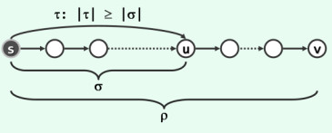
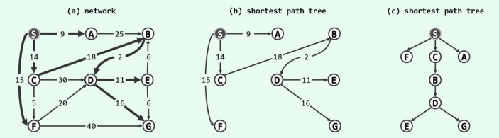
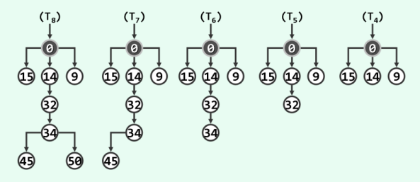
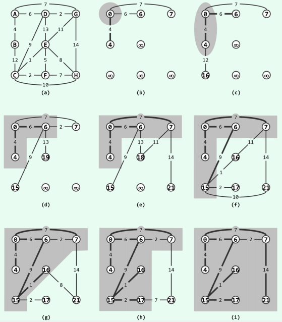

内容来自[数据结构c++语言版](https://book.douban.com/subject/25859528/), 我自己实现了代码部分.

# 最短路径树

## 单调性
如下图所示，设顶点 **s** 到 **v** 的最短路径为 **l** 。于是对于该路径上的任一顶点 **u**，若其在 **ρ** 上.对应的前缀为 **σ** ，则 **σ** 也必是 **s** 到 **u** 的最短路径 （之一）。否则，若从 **s** 到 **u** 还有另一严格更短的路径 **τ**，则易见 **ρ**不可能是 **s** 到 **v** 的最短路径。




较之最小生成树，最短路径的歧义性更难处理。首先，即便各边权重互异，从 **s** 到 **v** 的最短路径也未必唯一。另外，当存在非正权重的边，并导致某个环路的总权值非正时，最短路径甚至无从定义。因此以下不妨假定，带权网络 **G** 内各边权重均大于零。


## 无环性



如图(a)所示的任意带权网络中，考查从源点到其余顶点的最短路径（若有多条，任选其一）。于是由以上单调性，这些路径的并集必然不含任何（有向）回路。这就意味着，它们应如图(b)和图(c)所示，构成所谓的最短路径树( **shortest-path tree**) 。

# Dijkstra算法

## 最短路径子树序列

将顶点 **u<sub>i</sub>** 到起点 **s** 的距离记作： **d<sub>i</sub>= dist(s, u<sub>i</sub>), 1 ≤ i ≤ n** 。不妨设  **d<sub>i</sub>**  按非降序排列，即 **d<sub>i</sub> ≤ d<sub>j</sub>当且仅当i ≤ j** 。于是与 **s** 自身相对应地必有： **u<sub>1</sub>= s** 。

在从最短路径树 **T** 中删除顶点 **{ u<sub>k+1</sub>, u<sub>k+2</sub>, ..., u<sub>n</sub>}** 及其关联各边之后，将残存的子图记作 **T<sub>k</sub>** 。于是 **T<sub>n</sub>= T** , **T<sub>1</sub>** 仅含单个顶点 **s** 。实际上， **T<sub>k</sub>** 必为一棵树。为验证这一点，只需归纳证明  **T<sub>k</sub>** 是连通的。为从 **T<sub>k+1</sub>** 转到 **T<sub>k</sub>** 而删除的顶点 **u<sub>k+1</sub>** ，在 **T<sub>k+1</sub>** 中必是叶节点。而根据最短路径的单调性，作为 **T<sub>k+1</sub>** 中距离最远的顶点， **u</sub>k+1</sub>** 不可能拥有后代。

于是，如上定义的子树 **{ T<sub>1</sub>, T<sub>2</sub>, ..., T<sub>n</sub>}** ，便构成一个最短路径子树序列。

仍以上图中的最短路径树为例， 最后五棵最短路径子树， 如下图所示。为便于相互比对，其中每个顶点都注有其到 **s** 的距离。可见，只需从 **T<sub>k+1</sub>** 中删除距离最远的顶点 **u<sub>k+1</sub>** ，即可将 **T<sub>k+1</sub>** 转换至 **T<sub>k</sub>** 。



## 贪心迭代

颠倒上述思路可知，只要能够确定 **u<sub>k+1</sub>** ，便可反过来将 **T<sub>k</sub>** 扩展为 **T<sub>k+1</sub>** 。如此，便可按照到 **s** 距离的非降次序，逐一确定各个顶点 **{ u<sub>1</sub>, u<sub>2</sub>, ..., u<sub>n</sub>}** ，同时得到各棵最短路径子树，并得到最终的最短路径树 **T = T<sub>n</sub>**。现在，问题的关键就在于：

 **如何才能高效地找到u<sub>k+1</sub>？**

实际上，由最短路径子树序列的上述性质，每一个顶点 **u<sub>k+1</sub>** 都是在 **T<sub>k</sub>** 之外，距离 **s** 最近者。若将此距离作为各顶点的优先级数，则与最小支撑树的Prim算法类似，每次将 **u<sub>k+1</sub>** 加入 **T<sub>k</sub>** 并将其拓展至 **T<sub>k+1</sub>** 后，需要且只需要更新那些仍在 **T<sub>k+1</sub>** 之外，且与 **T<sub>k+1</sub>** 关联的顶点的优先级数。可见，该算法与 **Prim** 算法仅有一处差异：考虑的是 **u<sub>k+1</sub>** 到 **s** 的距离，而不再是其到 **T<sub>k</sub>** 的距离。

## 实例

依然以无环性那一节中图(a)的无向图为例，一次 **Dijkstra** 算法的完整执行过程如下图所示。图中阴影区域示意不断扩展的子树,粗线示意树边.



## 实现

一份简易的 **Dijkstra** 算法的 **cpp** 实现如下:

```cpp
#include <iostream>
#include <algorithm>
#include <queue>
#include <map>
#include <functional>
using namespace std;

const int MAX_NV = 100;	/* 顶点的最大值 */
using weight = int;

/**
 * @struct 图, 用邻接矩阵来表示图.
 */
struct Graph {
	int numOfVertexes; /* 顶点的数目 */
	int numOfEdges;	/* 边的数目 */
	weight matrix[MAX_NV][MAX_NV];
};


/**
 * @struct 距离,一个辅助结构,用于记录起点u到顶点v的距离,或者说到目前为止已知的最短距离
 */
struct Dist {
	int v; /* 路径的终点v,起点是u */
	int dist; /* 路径u -> v到目前为止已知的最短距离 */
	Dist(int u,int dist) : v(v), dist(dist) {}
	bool operator>(Dist& rhs) {
		return dist > rhs.dist;
	}
};

Graph g;
int dist[MAX_NV]; /* 记录起点到各个顶点的最小距离 */
int father[MAX_NV]; /* father[i]用于记录起点u通过最短路径到达顶点i时经过的中间顶点的编号 */

/**
 * @brief dijkstra算法求起点u到其余各个顶点的最短路径.
 * @param[in] g 图
 * @param[in] u 起点
 */
void dijkstra(const Graph& g, int u)
{
	priority_queue<Dist, vector<Dist>, greater<Dist>> container;
	int n = g.numOfVertexes; /* 顶点的数目 */
	std::fill(dist, dist + n, INT_MAX / 2);
	dist[u] = 0; /* 起点到自己的最短距离为0 */
	
	container.push(Dist(u, 0));
	while (!container.empty()) {
		Dist d = container.top(); 
		container.pop(); 
		for (int i = 0; i < n; ++i) {
			if (dist[d.v] + g.matrix[d.v][i] < dist[i]) {
				dist[i] = dist[d.v] + g.matrix[d.v][i];	/* 以节点v作为中间节点,从u到i距离更短 */
				father[i] = d.v; /* 从起点u到达i可以以v为中间节点 */
				container.push(Dist(dist[i], i));
			}
		}
	}
}


```


