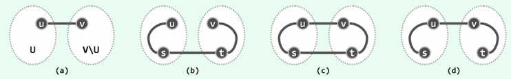
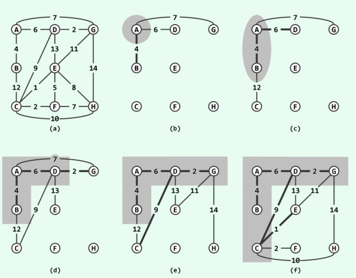
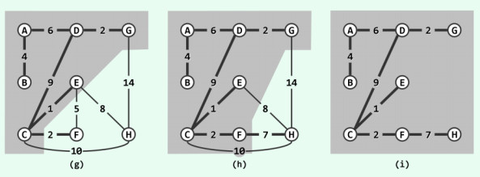

内容来自[数据结构c++语言版](https://book.douban.com/subject/25859528/), 我自己实现了代码部分.

# 最小生成树之Prim算法

## 割与短跨越边

图 `G = (V; E)` 中，顶点集 `V` 的任一非平凡子集 `U` 及其补集 `V\U` 都构成 `G` 的一个割(cut)，记作 `(U : V\U)`。若边 `uv` 满足 `u` 属于 `U` 且 `v` 不属于 `U`，则称作该割的一条跨越边( **crossing edge** )。因此类边联接于 `V` 及其补集之间，故亦形象地称作该割的一座桥( **bridge** )。

**Prim** 算法的正确性基于以下事实:  **最小支撑树总是会采用联接每一割的最短跨越边** 。否则，如下图(a)所示假设 `uv` 是割 `(U : V\U)` 的最短跨越边，而最小生成树 **T** 并未采用该边。于是由树的连通性，如图(b)所示在 **T** 中必有至少另一跨边 `st` 联接该割(有可能 `s = u` 或 `t =v`，尽管二者不能同时成立)。同样由树的连通性, **T** 中必有分别联接于 `u` 和 `s` 、 `v` 和 `t` 之间的两条通路。由于树是极大的无环图，故倘若将边 `uv` 加至 **T** 中，则如图(c)所示，必然出现穿过 `u` 、 `v` 、 `t` 和 `s` 的唯一环路。接下来，只要再删除边 `st` ，则该环路必然随之消失。



经过如此的一出一入，若设 **T** 转换为 **T'** ，则 **T'** 依然是连通图，且所含边数与 **T** 相同均为 `n - 1`。这就意味着, **T'**也是原图的一棵生成树。就结构而言， **T'** 与 **T** 的差异仅在于边 `uv` 和边 `st`，故二者的成本之差就是这两条边的权重之差。不难看出，边 `st` 的权重必然大于身为最短跨越边的 `uv`，故 **T'** 的总成本低于 **T** ,这与 **T** 总体权重最小的前提矛盾。

注意，以上性质并不意味着同一割仅能为最小生成树贡献一条跨越边.

## 贪心迭代

由以上性质，可基于贪心策略导出一个迭代式算法。每一步迭代之前，假设已经得到最小生成树 **T** 的一棵子树 **T<sub>k</sub>= (V<sub>k</sub>; E<sub>k</sub>)** ，其中 **V<sub>k</sub>** 包含 **k** 个顶点, **E<sub>k</sub>** 包含 **k - 1** 条边。于是，若将 **V<sub>k</sub>** 及其补集视作原图的一个割，则在找到该割的最短跨越边  **e<sub>k</sub> = (v<sub>k</sub>, u<sub>k</sub>) (v<sub>k</sub> ∈ V<sub>k</sub>且u<sub>k</sub> ∈ V<sub>k</sub>** )之后，即可将 **T<sub>k</sub>** 扩展为一棵更大的子树 **T<sub>k+1</sub> = (V<sub>k+1</sub>; E<sub>k+1</sub>)，其中 V<sub>k+1</sub>= V<sub>k</sub> ∪ {u<sub>k</sub>}，E<sub>k+1</sub> = E<sub>k</sub> ∪ {e<sub>k</sub>}** 。 最初的 **T<sub>1</sub>** 不含边而仅含单个顶点，故可从原图的顶点中任意选取。

## 实例





首先如图(b)所示，任选一个顶点A作为初始的子树 **T<sub>1</sub>= ({A}; ∅)** 。此时, **T<sub>1</sub>** 所对应的割共有 **AB**、 **AD** 和 **AG** 三条跨越边，故选取其中最短者AB，如图(c)所示将 **T<sub>1</sub>** 扩充至 **T<sub>2</sub>= ({A, B}; {AB})** 。此时, **T<sub>2</sub>** 所对应的割共有 **BC** 、 **AD** 和 **AG** 三条跨越边，依然选取其中最短者 **AD** ，如图(d)所示将 **T<sub>2</sub>** 扩充至 **T<sub>3</sub> = ({A, B, D}; {AB, AD})** 。如此反复，直至最终如图(i)所示得到： **T<sub>8</sub>=  ({A, B, D, G, C, E, F, H}; {AB, AD, DG, DC, CE, CF, FH})** , 此即原图的最小生成树。

可以证明，即便出现多条极短跨越边共存的退化情况，以上方法依然可行.

## 实现

`prim` 算法的简单实现.

```cpp
#include <iostream>
#include <vector>
#include <functional>
#include <queue>
using namespace std;

const int MAX_NV = 100;	/* 顶点的最大值 */
using weight = int;

/**
 * @struct 图,用邻接矩阵来表示.
 */
struct Graph {
	int numOfVertexes; /* 顶点的数目 */
	int numOfEdges; /* 边的数目 */
	weight matrix[MAX_NV][MAX_NV];
};

Graph g;
bool contained[MAX_NV];	/* 用于标记顶点是否已经加入最小生成树 */

/**
 * @struct 边,一个辅助结构,方便于求最小生成树.
 */
struct Edge {
	int u;
	int v;
	weight w;
	Edge(int u, int v, int w): u(u), v(v), w(w) {}
	bool operator>(const Edge& rhs) {
		return w > rhs.w;
	}
};


/**
 * @brief prim算法求最小生成树
 * @param[in] g 图
 */
void prim(const Graph &g) 
{
	priority_queue<Edge, vector<Edge>, greater<Edge>> container;
	/**
	 * 关于上面的式子,vector<Edge>表示优先队列使用vector来实现, greater<Edge>表示从小
	 * 到大排序.
	 */
	int n = g.numOfVertexes; /* 顶点的数目 */
	int u = 0; /* 开始的顶点的标号为0 */
	int count = 0; /* 边的数目计数 */
	contained[0] = true;
	std::fill(contained, contained + n, false);

	while (count < n - 1) { /* n个顶点最多n - 1条边 */
		for (int v = 0; v < n; v++) {
			if (!contained[v]) { /* 顶点v未被加入生成树 */
				Edge e(u, v, g.matrix[u][v]);
				container.push(e);
			}
		}

		while (!container.empty()) {
			Edge e = container.top(); 
			container.pop();
			if (!contained[e.v]) { /* 顶点v未被加入生成树 */
				u = e.v;
				contained[u] = true;
				count++;
				break;
			}
		}
	}

}
```

