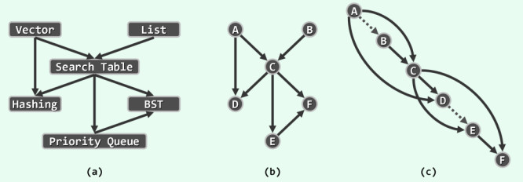
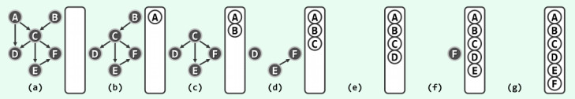

# 拓扑排序



以教材的编写这一实际问题为例。首先,作者可借助有向图结构，整理出相关知识点之间的依赖关系。如上图(a)所示，因向量是散列表和查找表的基础知识点，故从 **Vector** 发出两条边分别指向 **Hashing** 和 **Search Table** ；同理，查找表是二叉搜索树的基础知识点，故也从前者引出一条边指向后者；...；诸如此类。那么，如何将这些知识点串联为一份教学计划，以保证在整个授课进程中，每堂课的基础知识点均在此前业已讲授呢？

若将图(a)抽象为图(b)，则不难看出，图(c)就是一份可行的教材目录和授课计划。实际上，许多应用问题，都可转化和描述为这一标准形式：给定描述某一实际应用(图(a))的有向图(图(b))，如何在与该图“相容”的前提下，将所有顶点排成一个线性序列(图(c))。

此处的“相容”，准确的含义是：每一顶点都不会通过边，指向其在此序列中的前驱顶点。这样的一个线性序列，称作原有向图的一个拓扑排序( **topological sorting** )。

那么，拓扑排序是否必然存在？若存在，又是否唯一？这两个问题都不难回答。在上图(c)中，顶点A和B互换之后依然是一个拓扑排序，故同一有向图的拓扑排序未必唯一。若在图(b)中引入一条从顶点F指向B的边，使顶点B、C和F构成一个有向环路，则无论如何也不可能得到一个“相容”的线性序列，故拓扑排序也未必存在。

反之，不含环路的有向图, **有向无环图**, 一定存在拓扑排序吗？答案是肯定的。

有向无环图的拓扑排序必然存在；反之亦然。这是因为，有向无环图对应于偏序关系，而拓扑排序则对应于全序关系。在顶点数目有限时，与任一偏序相容的全序必然存在。

任一有限偏序集，必有极值元素(尽管未必唯一)；类似地，任一有向无环图，也必包含入度为零的顶点。否则，每个顶点都至少有一条入边，意味着要么顶点有无穷个，要么包含环路。

于是，只要将入度为0的顶点 **m** (及其关联边)从图G中取出，则剩余的 **G'** 依然是有向无环图，故其拓扑排序也必然存在。从递归的角度看，一旦得到了G'的拓扑排序，只需将m作为最大顶点插入，即可得到 **G** 的拓扑排序。如此，我们已经得到了一个拓扑排序的算法。



下面是拓扑排序的一个简易实现:

```cpp
#include <iostream>
#include <algorithm>
#include <queue>
#include <map>
#include <functional>
using namespace std;

/**
 * 这里的图使用邻接矩阵来表示,如果采用邻接表的话,可能会更加简单一点.
 */

const int MAX_NV = 100;	/* 顶点的最大值 */
using weight = int;
const int GRAPH_INF = INT_MAX / 2;

/**
 * @struct 图, 用邻接矩阵来表示图.
 */
struct Graph {
	int numOfVertexes; /* 顶点的数目 */
	int numOfEdges;	/* 边的数目 */
	weight matrix[MAX_NV][MAX_NV];
};

Graph g;
int topological[MAX_NV]; /* 拓扑排序的结果 */

/**
 * @brief 对图进行拓扑排序
 * @param[in] g 图
 * @return 如果排序成功,返回ture,否则返回false
 */
bool topo_sort(const Graph& g) 
{
	int n = g.numOfVertexes; /* 顶点的数目 */
	int degree[MAX_NV];
	int count = 0;
	queue<int> container;

	std::fill(degree, degree + n, 0);
	for (int i = 0; i < n; i++) {
		for (int j = 0; j < n; j++) {
			if (g.matrix[i][j] < GRAPH_INF) {
				degree[j]++; /* 顶点j的入度加1 */
			}
		}
	}
	
	for (int i = 0; i < n; i++) {
		if (degree[i] == 0) container.push(i); /* 如果顶点i不存在依赖,那么入队列 */
	}

	while (!container.empty()) {
		int v = container.front(); 
		container.pop();
		topological[count++] = v; /* 排序成功 */
		for (int i = 0; i < n; i++) {
			if (g.matrix[v][i] < GRAPH_INF) {
				if (--degree[i] == 0) container.push(i); /* 解除依赖 */
			}
		}
	}

	return count == n;
	/* 如果存在环的话,不可能排序成功 */
}
```

