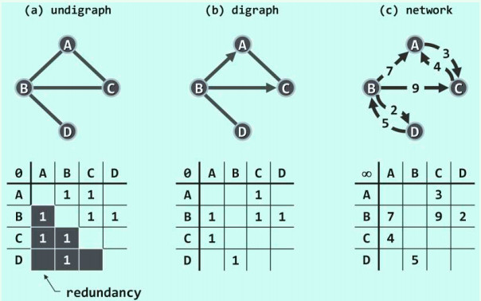
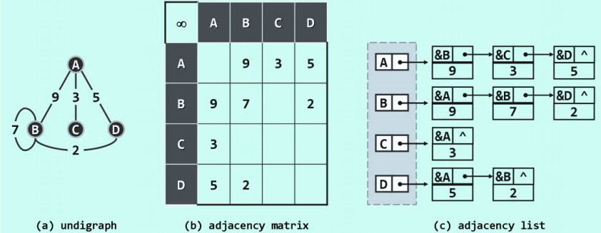

本文大部分来自数据结构(c++语言版)这本书.
# 邻接矩阵

邻接矩阵( **adjacency matrix** )是图最基本的实现方式,直接使用方阵 `A[n][n]` 表示由n个顶点构成的图,其中每一个单元,各自负责描述一对顶点之间可能存在的邻接关系.



对于无权图,存在(不存在)从顶点u到顶点v的边,当且仅当`A[u][v] = 1(0)`, 上图中的a,b分别是无向图和有向图的邻接矩阵实现.

这一表示方式，不难推广至带权网络。此时如图(c)所示，矩阵各单元可从布尔型改为整型或浮点型，记录所对应边的权重。对于不存在的边，通常统一取值为无穷或0。

下面是带权网络的一份简单实现:

```cpp
const int sz = 1024;
struct Graph {
  int numOfVertexes; /* 顶点的数目 */
  int numOfEdges; /* 边的数目 */
  int matrix[sz][sz];
}
```

# 邻接表

即便就有向图而言，**O(n<sup>2</sup>)** 的空间亦有改进的余地。实际上，如此大的空间足以容纳所有潜在的边。然而实际应用所处理的图，所含的边通常远远少于 **O(n<sup>2</sup>)** 。比如在平面图之类的稀疏图（sparse graph）中，边数渐进地不超过 **O(n)** ，仅与顶点总数大致相当。

由此可见，邻接矩阵的空间效率之所以低，是因为其中大量单元所对应的边，通常并未在图中出现。既然如此，为何不将这里的向量替换为列表呢？

是的，按照这一思路，的确可以导出图结构的另一种表示与实现形式。它就是邻接表表示法.



上图中的图对应的邻接矩阵表示和邻接表表示分别对应图b和图c.

下面是邻接表的一个简单实现:

```cpp
const int sz = 1024;

struct Edge {
	int to;
	struct Edge* next;
	int weight;
};

struct Vertex {
	struct Edge* next;
};

struct Graph {
	Vertex vertexes[sz]; /* 如果需要更加简洁的话,Vertex结构都可以丢掉 */ 
	int numOfEdges;		/* 边的数目 */
	int numOfVertexes; /* 顶点的数目 */
};
```

