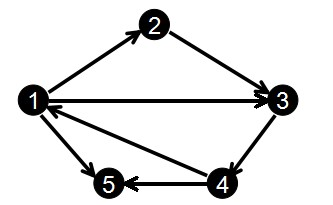
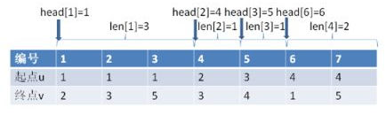

这篇文章要讲述的两种图的表示法是邻接表的变形,他们的实现比起邻接表更加简单方便,在实际的应用中,这两种结构用起来比邻接表更加得心应手.

# 前向星

我们首先来看一下什么是前向星.

前向星是一种特殊的边集数组,我们把边集数组中的每一条边按照起点从小到大排序,如果起点相同就按照终点从小到大排序,并记录下以某个点为起点的所有边在数组中的起始位置和存储长度,那么前向星就构造好了.


用 **len[i]** 来记录所有以 **i** 为起点的边在数组中的存储长度, 对于一些比较简洁的实现,这个数组其实是可以省略的.

用 **head[i]** 记录以 **i** 为起点的边集在数组中的第一个存储位置.

那么对于下图:



我们输入边的顺序为:
```shell
1 2
2 3
3 4
1 3
4 1
1 5
4 5
```
那么排完序后就得到:
```shell
编号:     1      2      3      4      5      6      7
起点u:    1      1      1      2      3      4      4
终点v:    2      3      5      3      4      1      5
```
得到:
```shell
head[1] = 1    len[1] = 3
head[2] = 4    len[2] = 1
head[3] = 5    len[3] = 1
head[4] = 6    len[4] = 2
```


利用前向星,我们可以在 **O(1)** 的时间找到以 **i** 为起点的第一条边,以 **O(len[i])** 的时间找到以 **i** 为起点的所有边.

下面是前向星的一个简单的实现:

```cpp
#include <iostream>
#include <algorithm>
#include <vector>
using namespace std;

const int sz = 1024;

int head[sz];

struct Edge {
	int from; /* 开始节点的编号 */
	int weight; /* 权重 */
	int to; /* 结束节点的编号 */
};

Edge edges[sz];

/**
 * @brief 排序函数,首先根据from从小到大排, from域相等的话, 根据to从小到大排,如果to域相等,根据weight从小到大排.
 * @param[in] lhs, rhs 左右两个需要比较的边.
 */
bool cmp(Edge& lhs, Edge& rhs) 
{
	if (lhs.from == rhs.from && lhs.to == rhs.to) return lhs.weight < rhs.weight;
	if (lhs.from == rhs.from) return lhs.to < rhs.to;
	return lhs.from < rhs.from;
}

int main()
{
	int numOfEdges, numOfVertexes;
	cin >> numOfEdges >> numOfVertexes;	/* 得到顶点的数目和边的数目 */

	for (int i = 0; i < numOfEdges; i++) {
		cin >> edges[i].from >> edges[i].to >> edges[i].weight;
	}
	sort(edges, edges + numOfEdges, cmp);
	
	/* 确定每一个顶点的起始边的编号 */
	head[edges[0].from] = 0;
	for (int i = 1; i < numOfEdges; i++) {
		if (edges[i].from != edges[i - 1].from) {
			head[edges[i].from] = i;
		}
	}

	for (int i = 1; i <= numOfVertexes; i++) {
		for (int k = head[i]; edges[k].from == i && k < numOfEdges; k++) {
			cout << edges[k].from << " " << edges[k].to << " " << edges[k].weight << endl;
		}
	}

	for (int i = 0; i <= numOfVertexes; i++) {
		cout << head[i] << " ";
	}
	cout << endl;
	getchar();
}
```


前向星特别适合用来优化稀疏图的深度优先搜索,广度优先搜索,单源最短路径.但是利用前向星会有排序操作,如果用快排时间至少为 **O(nlog(n))**.有没有什么方法可以避免掉这种排序呢?有的,那就是接下来要讲到的 **链式前向星**.

# 链式前向星

和之前的边结构体有所不同,这里我们建立的边结构体为:
```c++
struct Edge
{
     int next;
     int to;
     int w;
};
```

其中 `edge[i].to` 表示第 **i** 条边的终点, `edge[i].next` 表示与第 **i** 条边同起点的下一条边的存储位置, `edge[i].w` 为边权值.

另外还有一个数组 `head[]` ,它是用来表示以 **i** 为起点的第一条边存储的位置,实际上你会发现这里的第一条边存储的位置其实在以 **i** 为起点的所有边的最后输入的那个编号.

`head[]`数组一般初始化为 **-1** ,对于加边的 `add` 函数是这样的:
```c++
void add(int u,int v,int w)
{
    edge[cnt].w = w;
    edge[cnt].to = v;
    edge[cnt].next = head[u];
    head[u] = cnt++;
}
```
初始化 `cnt = 0`,这样,现在我们还是按照上面的图和输入来模拟一下:

```c++
edge[0].to = 2;     edge[0].next = -1;      head[1] = 0;
edge[1].to = 3;     edge[1].next = -1;      head[2] = 1;
edge[2].to = 4;     edge[2],next = -1;      head[3] = 2;
edge[3].to = 3;     edge[3].next = 0;       head[1] = 3;
edge[4].to = 1;     edge[4].next = -1;      head[4] = 4;
edge[5].to = 5;     edge[5].next = 3;       head[1] = 5;
edge[6].to = 5;     edge[6].next = 4;       head[4] = 6;
```

很明显, `head[i]` 保存的是以 **i** 为起点的所有边中编号最大的那个,而把这个当作顶点 **i** 的第一条起始边的位置.

这样在遍历时是倒着遍历的,也就是说与输入顺序是相反的,不过这样不影响结果的正确性.

比如以上图为例,以节点1为起点的边有3条,它们的编号分别是0, 3, 5.  而`head[1] = 5`.

我们在遍历以 **u** 节点为起始位置的所有边的时候是这样的:

```c++
for(int i = head[u]; i != -1; i = edge[i].next)
```

那么就是说先遍历编号为5的边,也就是 `head[1]`,然后就是 `edge[5].next`,也就是编号3的边,然后继续 `edge[3].next`,也就是编号0的边,可以看出是逆序的.

下面是链式前向星的一份简单实现:

```cpp
#include <iostream>
#include <algorithm>
#include <vector>
using namespace std;

const int sz = 1024;
int head[sz];

/**
 * @struct Edge 用于记录一条边.
 */
struct Edge {
	int to;	
	int weight;
	int next;		/* 用于记录同起点的下一条边的标号 */
};

Edge edges[sz];

/**
 * @brief 加边操作.
 * @param[in] u, v分别为起始节点的编号
 * @param[in] w 权重
 */
void add(int u, int v, int w)
{
	static int cnt = 0;
	edges[cnt].weight = w;
	edges[cnt].to = v;
	edges[cnt].next = head[u];
	head[u] = cnt++;
}

int main()
{
	int numOfEdges, numOfVertexes;
	int from, to, weight;
	memset(head, -1, sizeof(head));
	cin >> numOfEdges >> numOfVertexes;

	for (int i = 1; i <= numOfEdges; i++) {
		cin >> from >> to >> weight;
		add(from, to, weight);
		/*
		edges[i].to = to;
		edges[i].weight = weight;
		edges[i].next = head[from];
		head[from] = i;
		*/
	}

	/* traversal */
	for (int i = 1; i <= numOfVertexes; i++) {
		for (int k = head[i]; k != -1; k = edges[k].next) {
			cout << i << " " << edges[k].to << " " << edges[k].weight << endl;
 		}
	}
	getchar();
}
```

链式前向星比前向星更加好用,也更加常用.