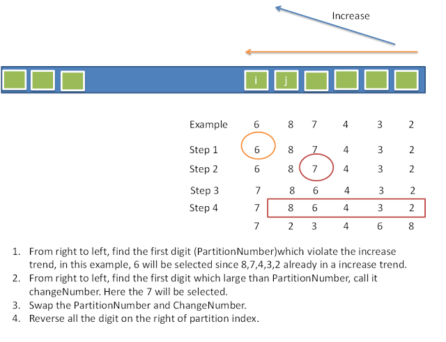

问题,实现 **STL** 中的 **next_permutation()** .

回答来自[stackoverflow](https://stackoverflow.com/questions/11483060/stdnext-permutation-implementation-explanation):

先让我们来看一些排列:

```c++
1 2 3 4
1 2 4 3
1 3 2 4
1 3 4 2
1 4 2 3
1 4 3 2
2 1 3 4
...
```

我们如何从一个排列转移到下一个排列呢?首先,让我们用另外一个角度来看待这个问题.如果将排列中每个元素视作一个数字(当然这里就是数字,但是元素是'a', 'b'的情况也是有的),每个排列视作一个数,情况将会如何?(上面的`1 2 3 4`视作`1234`.)

在这个角度之下,问题就变成了,我们应该如何重新排列这些数字,使得这些数字组成的数能够增大,当然,这里增大是有限制的,那就是 **增大的幅度应该是所有可能的情况中最小的** .以上面的排列为例,`1243`,`1324`,`1423`等一大票数都大于`1234`,但是我们只应当选择`1243`.

这样,寻找一个排列的下一个排列的问题就转化为了发现这些数字的另一种组合,使得这种组合组成的数字相对于之前的数字的增长幅度最小。

因此,就有了下面的算法:



1. 从右到左进行扫描,发现第一个违背递增趋势的数字,称之为 **PartitionNumber**, 如上图,`6`恰好是我们找到的 **PartitionNumber** .
2. 从右到左进行扫描,发现第一个比 **PartitionNumber** 要大的数,称之为 **ChangeNumber**.而7恰好是我们找到的 **ChangeNumber** ,需要注意的是,这样的数一定是存在的,否则的话,就找不到所以的 **PartitionNumber** 了.
3. 交换 **PartitionNumber** 和 **ChangeNumber**.这样一步,会使得新的排列组成的数比旧的排列组成的数要大,当然,新数增长的幅度不一定是最小的.
4. 反转在 **PartitionNumber** 右侧的数.此时, **PartitionNumber** 右侧的排列已经是严格的从大到小排列了,如此反转之后,可以保证,新的排列组成的数的增长幅度在所有的可能中最小.

对应的 **cpp** 实现:

```c++
#include <iostream>
using namespace std;

typedef int elem_t;


/**
 * @brief 交换数组中两个元素的位置
 * @param[in] array 数组首地址
 * @param[in] 数组下标
 * @param[in] 数组下标
 * @return 无
 **/
void
swap(elem_t array[], int i, int j)
{
	elem_t tmp = array[i];
	array[i] = array[j];
	array[j] = tmp;
}

/**
 * @brief 反转数组中从first位置到last位置(不包含last位置)的元素
 * @param[in] array 数组的首地址
 * @param[in] i 数组下标
 * @param[in] j 数组下标
 * @return 无
 **/
void reverse(elem_t array[], int first, int last)
{
	last--;
	while (first < last)
		swap(array, first++, last--);
}

/**
 * @brief 返回下一个排列
 * @param[inout] num 当前排列
 * @param[in] first 开始位置
 * @param[in] last 结束位置
 * @return 成功返回0,失败返回-1
 */
int
next_permutation(elem_t num[], int first, int last)
{
	int i, j;
	i = last - 2; /* PartitionNumber's index */
	while (i >= 0 && num[i] >= num[i + 1]) i--;

	if (i == -1) {
		reverse(num, first, last);
		return -1;
	}

	j = last - 1;
	while (num[j] <= num[i]) --j;
	swap(num, i, j);
	reverse(num, i + 1, last);
	return 0;
}

```

