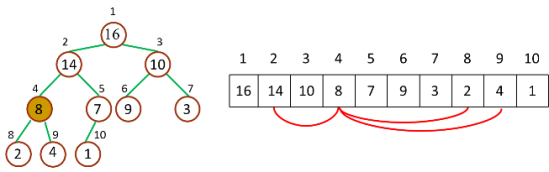
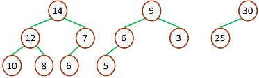
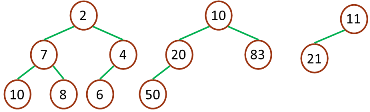

## 算法原理 ##

先上一张堆排序动画演示图片：


**1. 不得不说说二叉树**

要了解堆首先得了解一下[二叉树](http://zh.wikipedia.org/wiki/%E4%BA%8C%E5%8F%89%E6%A0%91)，在计算机科学中，二叉树是每个节点最多有两个子树的树结构。通常子树被称作“左子树”（left subtree）和“右子树”（right subtree）。二叉树常被用于实现[二叉查找树](http://zh.wikipedia.org/wiki/%E4%BA%8C%E5%85%83%E6%90%9C%E5%B0%8B%E6%A8%B9)和[二叉堆](http://zh.wikipedia.org/wiki/%E4%BA%8C%E5%8F%89%E5%A0%86)。

二叉树的每个结点至多只有二棵子树（不存在度大于 2 的结点），二叉树的子树有左右之分，次序不能颠倒。二叉树的第 i 层至多有 2<sup>i</sup> - 1 个结点；深度为 k 的二叉树至多有 2<sup>k</sup> - 1 个结点；对任何一棵二叉树 T，如果其终端结点数为 n<sub>0</sub>，度为 2 的结点数为 n<sub>2</sub>，则n<sub>0</sub> = n<sub>2</sub> + 1。

树和二叉树的三个主要差别：
- 树的结点个数至少为 1，而二叉树的结点个数可以为 0
- 树中结点的最大度数没有限制，而二叉树结点的最大度数为 2
- 树的结点无左、右之分，而二叉树的结点有左、右之分

二叉树又分为完全二叉树（complete binary tree）和满二叉树（full binary tree）

满二叉树：一棵深度为 k，且有 2<sup>k</sup> - 1 个节点称之为满二叉树


完全二叉树：深度为 k，有 n 个节点的二叉树，当且仅当其每一个节点都与深度为 k 的满二叉树中序号为 1 至 n 的节点对应时，称之为完全二叉树


<!--more-->

**2. 什么是堆？**

堆（二叉堆）可以视为一棵完全的二叉树，完全二叉树的一个“优秀”的性质是，除了最底层之外，每一层都是满的，这使得堆可以利用数组来表示（普通的一般的二叉树通常用链表作为基本容器表示），每一个结点对应数组中的一个元素。

如下图，是一个堆和数组的相互关系


对于给定的某个结点的下标 i，可以很容易的计算出这个结点的父结点、孩子结点的下标：

- Parent(i) = floor(i/2)，i 的父节点下标
- Left(i) = 2i，i 的左子节点下标
- Right(i) = 2i + 1，i 的右子节点下标



二叉堆一般分为两种：最大堆和最小堆。

最大堆：
- 最大堆中的最大元素值出现在根结点（堆顶）
- 堆中每个父节点的元素值都大于等于其孩子结点（如果存在）



最小堆：
- 最小堆中的最小元素值出现在根结点（堆顶）
- 堆中每个父节点的元素值都小于等于其孩子结点（如果存在）




**3. 堆排序原理**

堆排序就是把最大堆堆顶的最大数取出，将剩余的堆继续调整为最大堆，再次将堆顶的最大数取出，这个过程持续到剩余数只有一个时结束。在堆中定义以下几种操作：
- 最大堆调整（Max-Heapify）：将堆的末端子节点作调整，使得子节点永远小于父节点
- 创建最大堆（Build-Max-Heap）：将堆所有数据重新排序，使其成为最大堆
- 堆排序（Heap-Sort）：移除位在第一个数据的根节点，并做最大堆调整的递归运算

继续进行下面的讨论前，需要注意的一个问题是：数组都是 Zero-Based，这就意味着我们的堆数据结构模型要发生改变


相应的，几个计算公式也要作出相应调整：
- Parent(i) = floor((i-1)/2)，i 的父节点下标(floor代表向下取整)
- Left(i) = 2i + 1，i 的左子节点下标
- Right(i) = 2(i + 1)，i 的右子节点下标

最大堆调整（MAX‐HEAPIFY）的作用是保持最大堆的性质，是创建最大堆的核心子程序，作用过程如图所示：


由于一次调整后，堆仍然违反堆性质，所以需要递归的测试，使得整个堆都满足堆性质，用 cpp 可以表示如下：

``` c++
typedef int elem_t;

/**
 * @brief 交换数组中两个下标的值
 * @param[in] array 数组的地址
 * @param[in] idx1 第一个下标
 * @param[in] idx2 第二个下标
 */
void
swap(elem_t array[], int idx1, int idx2)
{
	elem_t temp = array[idx1];
	array[idx1] = array[idx2];
	array[idx2] = temp;
}

/**
 * @brief 从数组idx下标开始的地方,维持好最大堆的性质
 * @param[in] array 数组的地址
 * @param[in] idx 下标
 * @param[in] size 堆的大小
 */
void 
max_heaplify(elem_t array[], int idx, int size)
{
	int greater_val_idx = idx; /* greater_val_idx记录父子节点中较大值的下标 */
	int lchild_idx = 2 * idx + 1, rchild_idx = 2 * idx + 2; /* 左孩子和右孩子的下标 */

	if (lchild_idx < size && array[idx] < array[lchild_idx]) {
		greater_val_idx = lchild_idx;
	}

	if (rchild_idx < size && array[greater_val_idx] < array[rchild_idx]) {
		greater_val_idx = rchild_idx;
	}

	if (greater_val_idx != idx) {
		swap(array, greater_val_idx, idx);
		max_heaplify(array, greater_val_idx, size);
	}
}
```

通常来说，递归主要用在分治法中，而这里并不需要分治。而且递归调用需要压栈/清栈，和迭代相比，性能上有略微的劣势。当然，按照20/80法则，这是可以忽略的。但是如果你觉得用递归会让自己心里过不去的话，也可以用迭代，比如下面这样：

``` c++
/**
* @brief max_heaplify函数的非递归版本
* @param[in] array 数组的地址
* @param[in] idx 下标
* @param[in] size 堆的大小
*/
void max_heaplify_non_recursive(elem_t array[], int idx, int size)
{
	int greater_val_idx, lchild_idx, rchild_idx;
	while (true) {
		greater_val_idx = idx;
		lchild_idx = 2 * idx + 1;	/* 左孩子的下标 */
		rchild_idx = 2 * idx + 2;	/* 右孩子的下标 */

		if (lchild_idx < size && array[idx] < array[lchild_idx]) {
			greater_val_idx = lchild_idx;
		}

		if (rchild_idx < size && array[greater_val_idx] < array[rchild_idx]) {
			greater_val_idx = rchild_idx;
		}

		if (greater_val_idx != idx) {
			swap(array, greater_val_idx, idx);
			idx = greater_val_idx;
		}
		else break;
	}
}
```

创建最大堆（Build-Max-Heap）的作用是将一个数组改造成一个最大堆，接受数组和堆大小两个参数，Build-Max-Heap 将自下而上的调用 Max-Heapify 来改造数组，建立最大堆。因为 Max-Heapify 能够保证下标 i 的结点之后结点都满足最大堆的性质，所以自下而上的调用 Max-Heapify 能够在改造过程中保持这一性质。如果最大堆的数量元素是 n，那么 Build-Max-Heap 从 Parent(n) 开始，往上依次调用 Max-Heapify。流程如下：


用 cpp 描述如下：

``` c++

/**
 * @brief 构建最大堆
 * @param[in] array 数组
 * @param[in] size 数组的大小
 */
void 
build_max_heap(elem_t array[], int size) {
	int parent_idx = (int)floor((size - 1) / 2);
	for (int i = parent_idx; i >= 0; i--) {
		max_heaplify(array, i, size);
	}
}
```

堆排序（Heap-Sort）是堆排序的接口算法，Heap-Sort先调用Build-Max-Heap将数组改造为最大堆，然后将堆顶和堆底元素交换，之后将底部上升，最后重新调用Max-Heapify保持最大堆性质。由于堆顶元素必然是堆中最大的元素，所以一次操作之后，堆中存在的最大元素被分离出堆，重复n-1次之后，数组排列完毕。整个流程如下：


用 cpp 描述如下：

``` c++
/**
 * @brief 堆排序
 * @param[in] array 待排序的数组
 * @param[in] size 数组的大小
 */
void
heap_sort(elem_t array[8], int size)
{
	build_max_heap(array, size); /* 构建最大堆 */
	for (int i = size - 1; i > 0; i--) {
		swap(array, 0, i);
		max_heaplify(array, 0, i);
	}
}
```


## cpp 语言实现 ##

最后，把上面的整理为完整的 cpp 代码如下：

``` c++
#include <iostream>
using namespace std;

typedef int elem_t;

/**
 * @brief 交换数组中两个下标的值
 * @param[in] array 数组的地址
 * @param[in] idx1 第一个下标
 * @param[in] idx2 第二个下标
 */
void
swap(elem_t array[], int idx1, int idx2)
{
	elem_t temp = array[idx1];
	array[idx1] = array[idx2];
	array[idx2] = temp;
}

/**
 * @brief 从数组idx下标开始的地方,维持好最大堆的性质
 * @param[in] array 数组的地址
 * @param[in] idx 下标
 * @param[in] size 堆的大小
 */
void 
max_heaplify(elem_t array[], int idx, int size)
{
	int greater_val_idx = idx; /* greater_val_idx记录父子节点中较大值的下标 */
	int lchild_idx = 2 * idx + 1, rchild_idx = 2 * idx + 2; /* 左孩子和右孩子的下标 */

	if (lchild_idx < size && array[idx] < array[lchild_idx]) {
		greater_val_idx = lchild_idx;
	}

	if (rchild_idx < size && array[greater_val_idx] < array[rchild_idx]) {
		greater_val_idx = rchild_idx;
	}

	if (greater_val_idx != idx) {
		swap(array, greater_val_idx, idx);
		max_heaplify(array, greater_val_idx, size);
	}
}


/**
* @brief max_heaplify函数的非递归版本
* @param[in] array 数组的地址
* @param[in] idx 下标
* @param[in] size 堆的大小
*/
void max_heaplify_non_recursive(elem_t array[], int idx, int size)
{
	int greater_val_idx, lchild_idx, rchild_idx;
	while (true) {
		greater_val_idx = idx;
		lchild_idx = 2 * idx + 1;	/* 左孩子的下标 */
		rchild_idx = 2 * idx + 2;	/* 右孩子的下标 */

		if (lchild_idx < size && array[idx] < array[lchild_idx]) {
			greater_val_idx = lchild_idx;
		}

		if (rchild_idx < size && array[greater_val_idx] < array[rchild_idx]) {
			greater_val_idx = rchild_idx;
		}

		if (greater_val_idx != idx) {
			swap(array, greater_val_idx, idx);
			idx = greater_val_idx;
		}
		else break;
	}
}

/**
 * @brief 构建最大堆
 * @param[in] array 数组
 * @param[in] size 数组的大小
 */
void 
build_max_heap(elem_t array[], int size) {
	int parent_idx = (int)floor((size - 1) / 2);
	for (int i = parent_idx; i >= 0; i--) {
		max_heaplify(array, i, size);
	}
}

/**
 * @brief 堆排序
 * @param[in] array 待排序的数组
 * @param[in] size 数组的大小
 */
void
heap_sort(elem_t array[8], int size)
{
	build_max_heap(array, size); /* 构建最大堆 */
	for (int i = size - 1; i > 0; i--) {
		swap(array, 0, i);
		max_heaplify(array, 0, i);
	}
}

int main()
{
	elem_t array[] = { 1, 5, 6, 10, 8, 7, 99, 35 };
	int size = sizeof(array) / sizeof(elem_t);
	heap_sort(array, size);
	for (int i = 0; i < size; i++) {
		cout << array[i] << endl;
	}
	getchar();
}


```

## 参考文章 ##
- [Wikipedia](http://en.wikipedia.org/wiki/Heapsort)
- [维基百科，堆排序](http://zh.wikipedia.org/wiki/%E5%A0%86%E6%8E%92%E5%BA%8F)
- [维基百科，二叉树](http://zh.wikipedia.org/wiki/%E4%BA%8C%E5%8F%89%E6%A0%91)
- [Algorithms Chapter 6 Heapsort](http://ind.ntou.edu.tw/~litsnow/al98/pdf/Algorithm-Ch6-Heapsort.pdf)
- [Heap Sort](http://www.personal.kent.edu/~rmuhamma/Algorithms/MyAlgorithms/Sorting/heapSort.htm)
- [堆与堆排序](http://blog.kingsamchen.com/archives/547#viewSource)
- [堆排序](http://student.zjzk.cn/course_ware/data_structure/web/paixu/paixu8.4.2.1.htm)
- [堆排序(Heap Sort)算法学习](http://www.nowamagic.net/algorithm/algorithm_HeapSortStudy.php)
- [Sorting Algorithm Animations](http://www.sorting-algorithms.com/)